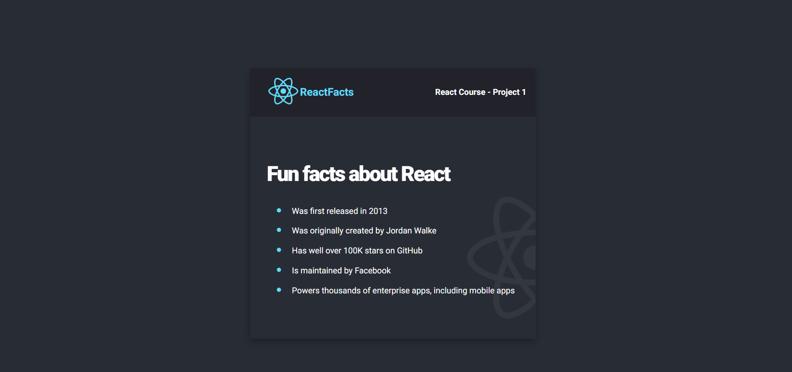

###  React Info Site
- This static site has been build by following the figma design from the [FreeCodeAcadempy youtube video](https://www.youtube.com/watch?v=bMknfKXIFA8) and [scrimba course](https://scrimba.com/learn/learnreact).
- The main goal of this project was to learn the basics of React such as, JSX, custom components, and styling. 

The static website:

